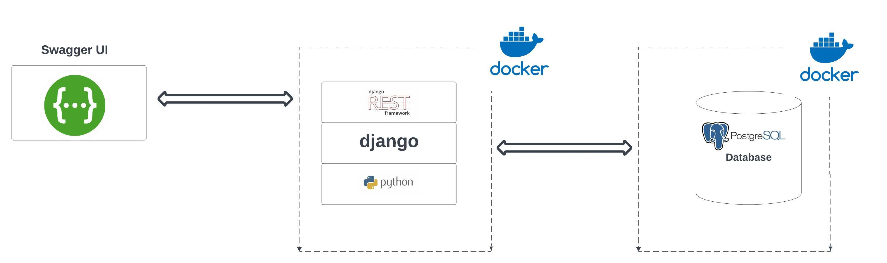
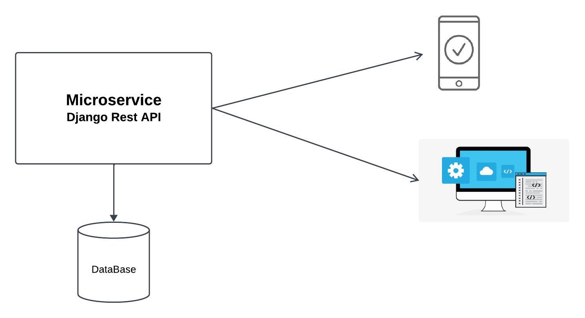

# MicroServices-DjangoRestApi
# TechStack 

# Overview Of the MicroService Application 

# Features
- 19 API Endpoints
- Managing users, recipes, tags, ingredients
- User Authentication
- Browseable Admin Interface (Django Admin)
- Browsable API (Swagger)